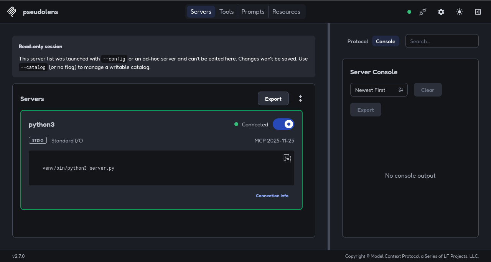
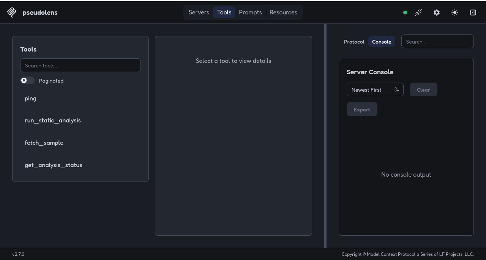
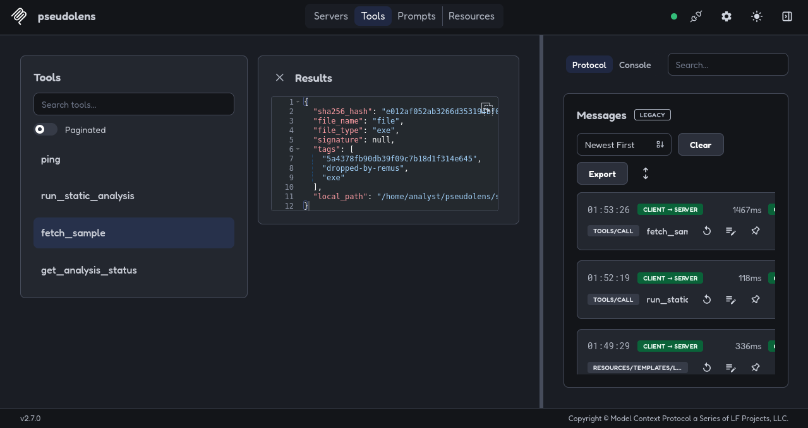
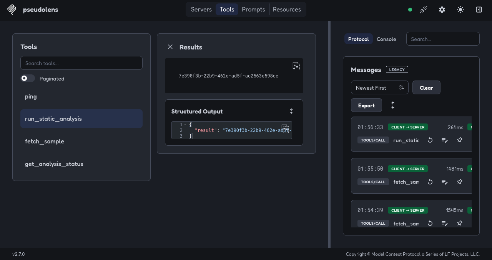
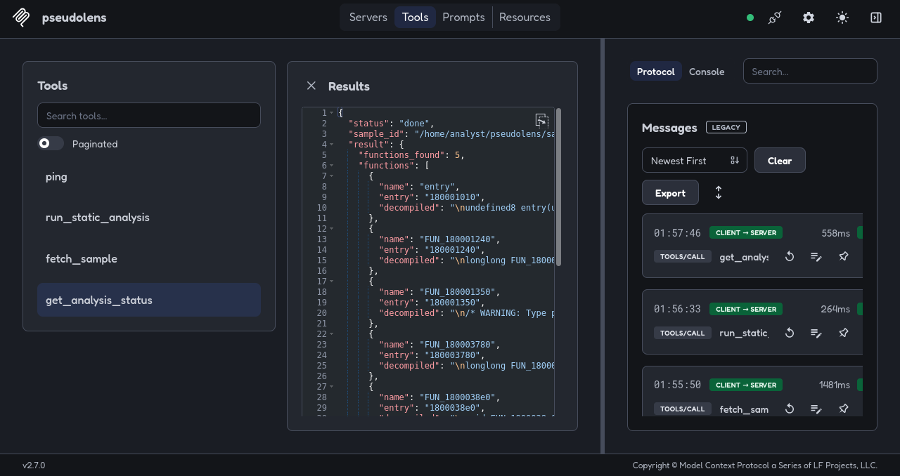

# PseudoLens

An MCP server that wraps isolated, headless Ghidra static analysis as callable tools, so an AI agent can fetch a real malware sample, analyze it safely, and reason about what it does function by function.

I built this because reverse engineering usually means opening a sample in Ghidra or IDA, manually reading disassembly, and cross referencing imports and strings by hand. There's no structured way for an AI agent to participate in that process, since there's no interface between "here's a binary" and "here's what it does." PseudoLens is that interface: an MCP server (Model Context Protocol) that wraps a real Ghidra headless pipeline as a set of tools an agent can call directly, one function at a time rather than getting one giant blob dumped all at once.

The core pipeline works end to end. I've run it against a live sample pulled from MalwareBazaar and it correctly extracted decompiled logic, imports, and strings that identified the sample's actual behavior. See the worked example below.

## What it does

1. Fetches real malware samples from MalwareBazaar by SHA256 hash. Downloads the AES encrypted archive, extracts it, and stages it locally as an inert file that's never executed.
2. Runs every analysis inside a fresh Docker container launched with `--network none`, so a sample can never make an outbound connection or touch anything else on the host, no matter what it tries to do.
3. Runs Ghidra's real headless auto analysis: full disassembly, function identification, and the standard 30+ analyzer pipeline, the same engine a human analyst would use interactively.
4. Keeps the analyzed Ghidra project on disk after the initial pass, so it can be reopened later instead of re-running full analysis from scratch.
5. Decompiles functions to C-like pseudocode on demand, one function at a time, using Ghidra's `DecompInterface` API. Results are cached per job, so asking for the same function twice is instant.
6. Extracts imported libraries and embedded strings, the fastest signals for identifying malware family and behavior.
7. Lets you search whatever's already been decompiled for calls to a specific API, useful for questions like "which functions call CreateRemoteThread."
8. Runs the initial analysis as an async job so a long running task doesn't block the calling agent. `run_static_analysis` returns a job ID right away, `get_analysis_status` polls for the result.

## Architecture

```
MalwareBazaar API -> fetch_sample (Auth-Key header, AES zip extraction)
                            |
                            v
                  local sample (inert file, never executed)
                            |
                            v
      run_static_analysis (spawns background thread)
                            |
                            v
 Docker container, --network none, ephemeral
      |
      +--> analyzeHeadless (Ghidra 12.1.3, full auto-analysis, -import)
      |
      +--> ExtractInfo.java (post-script: function list, imports, strings)
                            |
                            v
      persisted Ghidra project (bind-mounted to host, survives
      after the container is removed)
                            |
                            v
      list_functions / get_strings / get_imports
      (read straight from the stored result)
                            |
                            v
      decompile_function(name) -> new ephemeral container reopens
      the persisted project via -process, runs DecompileOne.java
      on just that one function, caches the result
                            |
                            v
      search_functions_by_api(name) -> searches whatever's
      already been decompiled and cached
```

The isolation is the whole point here. A sample sits on disk as inert data, and the only thing that ever touches it is a container with no network access, disassembling it statically. It is never executed, on the host or in the container.

## Quick start

```bash
git clone <this repo>
cd pseudolens

# builds the isolated analysis image, downloads and verifies Ghidra's
# SHA256 at build time, see docker/Dockerfile
docker build -t pseudolens-ghidra:latest docker/

python3 -m venv venv
source venv/bin/activate
pip install -r requirements.txt

export MALWAREBAZAAR_AUTH_KEY="your_key_from_auth.abuse.ch"

# test with the MCP Inspector. env vars need to be passed explicitly,
# the Inspector doesn't forward the parent shell's environment
npx @modelcontextprotocol/inspector -e MALWAREBAZAAR_AUTH_KEY=$MALWAREBAZAAR_AUTH_KEY venv/bin/python3 server.py
```

## Tools

| Tool | Description |
|---|---|
| `fetch_sample(sha256_hash)` | Downloads and extracts a sample from MalwareBazaar by hash |
| `run_static_analysis(sample_id)` | Launches isolated Ghidra analysis, returns a `job_id`. Keeps the analyzed project on disk afterward |
| `get_analysis_status(job_id)` | Polls job status, returns the overview result when done |
| `list_functions(job_id)` | Lists every function found, name and entry address only |
| `decompile_function(job_id, function_name)` | Decompiles one function on demand, reopening the persisted project instead of re-analyzing. Cached after the first call |
| `get_strings(job_id)` | Extracted string constants |
| `get_imports(job_id)` | Imported libraries |
| `search_functions_by_api(job_id, api_name)` | Searches already-decompiled functions for calls to a given API |
| `ping()` | Connectivity check |

## Verified so far

- MCP server over stdio transport
- Async job pattern (queued, running, done or failed), tested under real timing
- Docker orchestration of Ghidra headless with `--network none` isolation
- Real malware sample fetch from MalwareBazaar, AES encrypted zip, Auth-Key header auth
- Custom Java post-analysis script (`ExtractInfo.java`) for function list, imports, strings
- Persistent Ghidra project storage, reopened later without re-running full analysis
- On-demand, per-function decompilation via `DecompInterface`, called through a second Ghidra script (`DecompileOne.java`) that reopens the persisted project in `-process` mode
- API-based function search over already-decompiled code
- A full end-to-end run against a real, live malware sample, see the worked example below

## Worked example

I ran `fetch_sample` and `run_static_analysis` against a sample tagged `dropped-by-remus` on MalwareBazaar. It came back as a 5-function Windows PE with imports limited to `KERNEL32.DLL` and `USER32.DLL`, including `OpenClipboard`, `GetClipboardData`, `SetClipboardData`, and `EmptyClipboard`.

Calling `decompile_function` on `entry` shows a loop polling `GetClipboardSequenceNumber()`, reading `CF_UNICODETEXT` clipboard content whenever it changes, and running that text through a heavily obfuscated pattern matcher (stack string XOR decoding plus vectorized character comparisons, which is a pretty classic anti-analysis technique). If the pattern matches, it calls `SetClipboardData` to overwrite the clipboard content. Calling `search_functions_by_api` for `SetClipboardData` correctly surfaces `entry` as the match.

That's the standard behavior of a cryptocurrency clipboard hijacker: wait for a copied wallet address, check the format, and silently swap in an attacker-controlled address before the victim pastes it into a transaction.

## Screenshots

**MCP server connected**


**Tools registered**


**Fetching a real sample from MalwareBazaar**


**Launching analysis, returns a job ID immediately (async pattern)**


**Decompiled analysis result on a live malware sample**


## Problems I ran into building this

- **Container DNS resolution under `--network none`.** Ghidra's logging setup calls `InetAddress.getLocalHost()`, which fails outright with no network stack in the container. Fixed with an explicit `hostname` plus an `extra_hosts` mapping so the lookup resolves locally instead of going out to DNS.
- **Ghidra 12.x dropped Jython.** Headless post-scripts written in Python fail with "Ghidra was not started with PyGhidra" unless you launch the container through PyGhidra's own entrypoint. Instead of taking on that dependency, I wrote the extraction scripts in Java (`ExtractInfo.java`, `DecompileOne.java`), which Ghidra compiles and runs on the fly with no special startup path needed.
- **Cross-container file ownership.** Files written by the container's root process into a bind-mounted output directory come out owned by root and unreadable by the host user. Fixed by having the container chown its own output to the host's UID/GID right before it exits.
- **MalwareBazaar's AES encrypted zips.** Python's stdlib `zipfile` only supports the older ZipCrypto scheme, and MalwareBazaar's archives use WinZip AES, which raises `NotImplementedError`. Fixed by switching to `pyzipper.AESZipFile`.
- **Persisting the Ghidra project across container runs.** The first version of this ran every analysis in a throwaway container filesystem, so the analyzed project vanished the moment the container exited, which meant only a single bulk decompile pass was possible. Fixed by bind-mounting a per-job host directory into the container as the project directory, so a later container can reopen it with `analyzeHeadless -process` instead of re-importing and re-analyzing from scratch.
- **Command injection through a tool argument.** `decompile_function` takes a function name that ends up inside a shell command string. Added a strict allowlist regex (alphanumeric, underscore, dot, dollar only) that rejects anything else before it ever touches the command.

## Limitations

- No IDA Pro integration, despite how I originally framed the project. Ghidra headless alone has been enough so far.
- String extraction is a straightforward walk over defined data with a string value. No entropy analysis, no separating out attacker-meaningful strings like C2 domains or mutex names from ordinary library boilerplate.
- No MITRE ATT&CK tagging or findings database yet. Right now behavior classification (like calling this a clipboard hijacker) happens in conversation with the AI, not stored anywhere structured. That's the next piece I'm building.
- No YARA rule generation or analyst report generation yet, also planned next.

## Author

Lokesh Sivaprakash

## License

MIT
